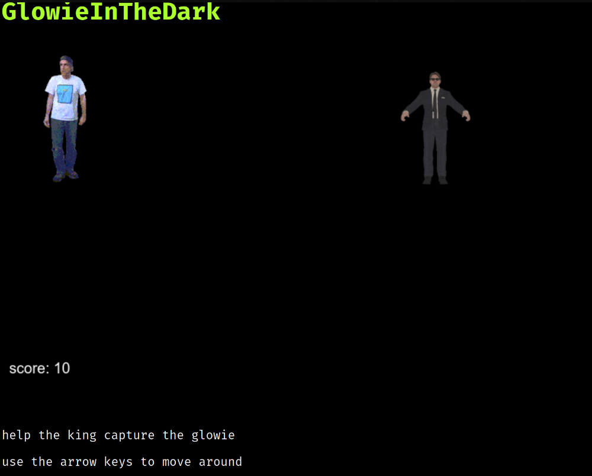

# [GlowieInTheDark](https://l0vemimi.github.io/GlowieInTheDark/)

Simple pointless js browser game. I don't really know why I made this or where I'll go with it so it's still a work in progress (maybe).

**HOW TO PLAY:** Move Terry around with your arrow keys and catch the glowie. Each time you catch him, you get points. That's it. I may or may not implement more features; for now it's just a silly game that captures 1 min worth's your attention span.

**REQUIREMENTS:** Computer with a keyboard. It should logically work with other devices (mobile) that are capable of using an internet browser with a virtual keyboard.
